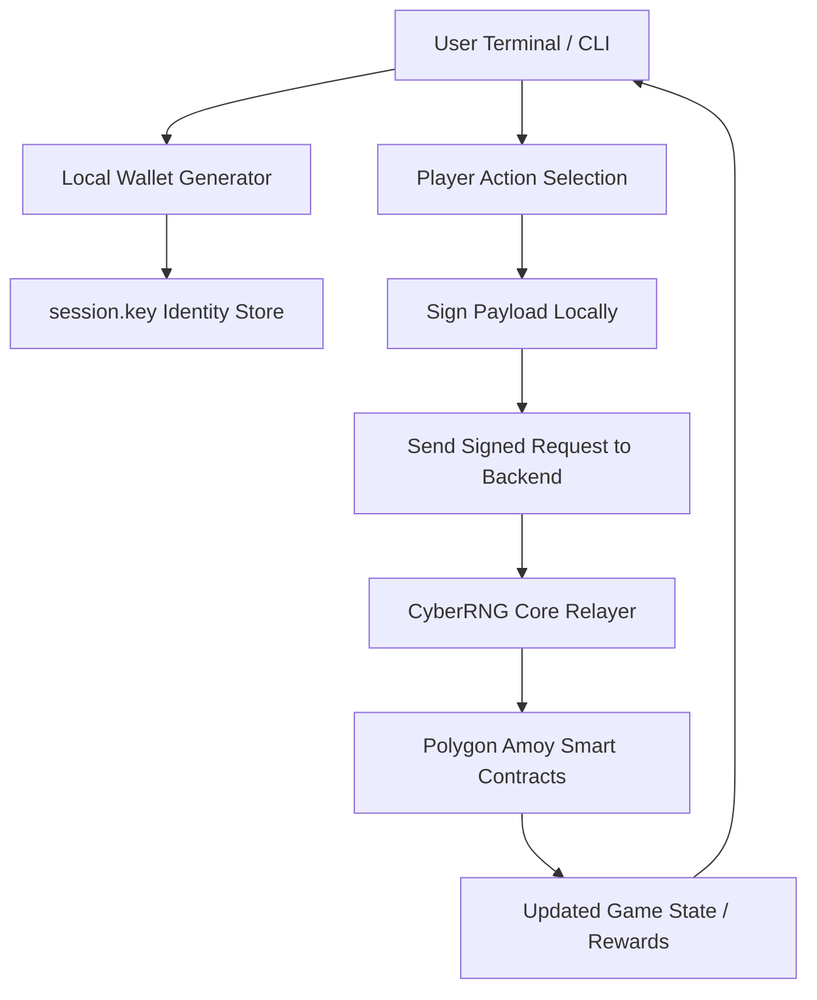

# CYBER UPLINK – TERMINAL CLIENT

```txt
  ______   ______  _____ ____    _   _ ____  _     ___ _   _ _  __
 / ___\ \ / / __ )| ____|  _ \  | | | |  _ \| |   |_ _| \ | | |/ /
| |    \ V /|  _ \|  _| | |_) | | | | | |_) | |    | ||  \| | ' / 
| |___  | | | |_) | |___|  _ <  | |_| |  __/| |___ | || |\  | . \ 
 \____| |_| |____/|_____|_| \_\  \___/|_|   |_____|___|_| \_|_|\_\
                      C Y B E R   U P L I N K
```

<div align="center">

### The Interface to the Shadow Network.

<p>
  
  
  
</p>

<p>
  
  
  
</p>

</div>

---

## 📟 Table of Contents

- [🔓 Access Log](#-access-log)
- [👁️ Visuals](#️-visuals)
- [💾 Installation](#-installation)
- [🎮 Operations Manual](#-operations-manual)
- [📡 CLI Architecture](#-cli-architecture)
- [⚙️ Configuration](#️-configuration)

---

## 🔓 Access Log

**Cyber Uplink** is a standalone terminal client built with **Go**.  
It provides an immersive, hacker-style interface to interact with the **CyberRNG blockchain game**.

The client is responsible for:

- Generating and managing a local wallet
- Cryptographically signing player actions
- Sending signed payloads to the CyberRNG Core backend
- Rendering a responsive CLI/TUI HUD

> **System Integrity:** `100%`  
> **Interface:** `CLI / TUI`  

---

## 👁️ Visuals

The client features a color-coded HUD and real-time feedback:

- **HUD System**
  - Wallet Address
  - $HASH Balance
  - Active Rig Power (GH/s)
  - Cooldowns and Mission Progress

- **Rarity Color Coding**
  - COMMON – Gray  
  - UNCOMMON – Green  
  - RARE – Blue  
  - EPIC – Purple  
  - LEGENDARY – Gold  

- **Animations**
  - Loading bars for hacking/mining
  - Cooldown countdowns
  - Staking / rewards updates

---

## 💾 Installation

### Prerequisite

- Go (Golang) **1.20+**

### 1. Clone the Uplink

```bash
git clone https://github.com/rafidef/cyber-rng-client.git
cd cyber-rng-client
```

### 2. Install Modules

```bash
go mod tidy
```

### 3. Run the Client

```bash
go run main.go
```

### 4. Build Executable (Optional)

```bash
# Linux / macOS
go build -o uplink main.go
./uplink

# Windows
go build -o uplink.exe main.go
uplink.exe
```

---

## 🎮 Operations Manual

Once connected, the following modules are available:

### [1] HACK_NODE (Mining)

Execute a brute-force attack on the network.

- **Cost:** 0 Gas  
- **Cooldown:** 30s (reducible via GPU upgrades)  
- **Rewards:** Artifacts, Hardware, Consumables, Materials  

---

### [2] CYBERDECK (Loadout)

Manage your permanent equipment:

- **GPU** – Reduces mining cooldown (up to −15s)  
- **VPN** – Increases LUCK (better drop tables / higher rarity chances)  

---

### [3] WORKSHOP (Overclock)

Upgrade equipment stats using:

- Silicon Scraps  
- Overclock Chips  

> **Warning:** High-level enchants can fail. On failure, materials are consumed.

---

### [4] INVENTORY

- **Salvage:** Burn useless artifacts for **$HASH**  
- **Use:** Consume items like:
  - Thermal Paste (Cooldown Reset)
  - Loot Crates
  - Temporary Buff Items  

---

### [5] SHADOW_NET

- **Daily Contracts:** 3 procedurally generated missions (Mine, Spend, Hunt)  
- **Leaderboard:** View the top 10 richest hackers in the network  

---

### [6] SERVER_ROOM

Stake your unused hardware to earn **passive income** (`$HASH/sec`).

> Items staked in the server room cannot be used for mining bonuses while locked.

---

## 📡 CLI Architecture



---

## ⚙️ Configuration

### Connection (SERVER_URL)

By default, the client assumes the backend is running locally.

In `main.go`, edit the `SERVER_URL` constant:

```go
const SERVER_URL = "http://localhost:3000"
```

If your backend is hosted remotely (for example on a VPS):

```go
const SERVER_URL = "https://api.your-domain.tld" // or http://YOUR_VPS_IP:3000
```

Make sure:

- Port and protocol match your backend configuration
- Any reverse proxy (Nginx, Caddy, etc.) forwards requests to CyberRNG Core

---

### Identity (session.key)

On first run, the client generates a file named **`session.key`** in the working directory.

This file:

- Contains your **encrypted private key** in Hex format  
- Is used to persist your in-game identity between runs  

**Security Notes:**

- DO NOT SHARE this file with anyone  
- DO NOT commit it to Git or any VCS  
- To reset your account/wallet:
  - Delete `session.key`
  - Re-run the client to generate a new identity  

---

<div align="center">
  <br><br>
  <sub>Welcome to the Shadow Network.</sub>
</div>
