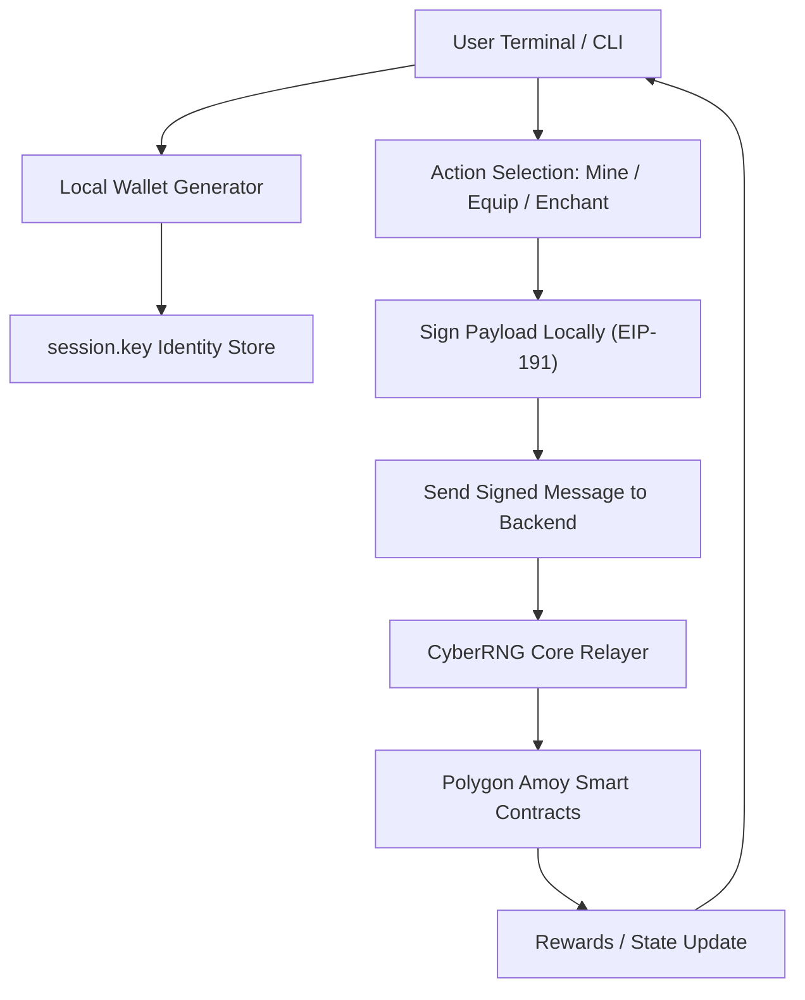

# CYBER UPLINK – TERMINAL CLIENT

```txt
  ______   ______  _____ ____    _   _ ____  _     ___ _   _ _  __
 / ___\ \ / / __ )| ____|  _ \  | | | |  _ \| |   |_ _| \ | | |/ /
| |    \ V /|  _ \|  _| | |_) | | | | | |_) | |    | ||  \| | ' / 
| |___  | | | |_) | |___|  _ <  | |_| |  __/| |___ | || |\  | . \ 
 \____| |_| |____/|_____|_| \_\  \___/|_|   |_____|___|_| \_|_|\_\
                      C Y B E R   U P L I N K
```

<div align="center">

### The Interface to the Shadow Network.

<p>
  
  
  
  
</p>

<p>
  
  
  
</p>

</div>

---

## 📟 Table of Contents
- [🔓 Access Log](#-access-log)
- [👁️ Visuals](#️-visuals)
- [💾 Installation](#-installation)
- [🎮 Operations Manual](#-operations-manual)
- [📡 CLI Architecture](#-cli-architecture)
- [⚙️ Configuration](#️-configuration)

---

## 🔓 Access Log

**Cyber Uplink** is a Go-powered terminal client for the **CyberRNG Network**, providing:

- Local wallet generation  
- Offline signing & identity  
- Secure message relaying  
- TUI/HUD mining interface  

> **System Integrity:** `100%`  
> **Interface:** `CLI / TUI`  
> **Latency Mode:** `Ultra Low`  

---

## 👁️ Visuals

HUD Information:
- Wallet Address  
- $HASH Balance  
- Mining Cooldown  
- Rig Stats (GH/s)  
- Mission Tracking  

Rarity Colors:

| Rarity | Color |
|--------|--------|
| COMMON | Gray |
| UNCOMMON | Green |
| RARE | Blue |
| EPIC | Purple |
| LEGENDARY | Gold |

---

## 💾 Installation

### **Prerequisite**
Go 1.20+ installed.

### **1. Clone Uplink**
```bash
git clone https://github.com/yourusername/cyber-rng-client.git
cd cyber-rng-client
```

### **2. Install Modules**
```bash
go mod tidy
```

### **3. Run Client**
```bash
go run main.go
```

Or build binary:
```bash
go build -o uplink main.go
./uplink
```

---

## 🎮 Operations Manual

### **[1] HACK_NODE (Mining)**  
Bruteforce mining operations.

### **[2] CYBERDECK (Loadout)**  
Equip GPU / VPN.

### **[3] WORKSHOP (Overclock)**  
Enhance equipment stats.

### **[4] INVENTORY**  
Use, destroy, salvage items.

### **[5] SHADOW_NET**  
Daily Contracts & Leaderboard.

### **[6] SERVER_ROOM**  
Stake hardware for income.

---

## 📡 CLI Architecture



---

## ⚙️ Configuration

### **Backend Endpoint**
```go
const SERVER_URL = "http://localhost:3000"
```

### **Identity File (session.key)**

- Auto-generated on first run  
- Encrypted private key (Hex)  
- Delete file to regenerate identity  

---

<div align="center">
<br><br>
<sub>Welcome to the Shadow Network.</sub>
</div>
